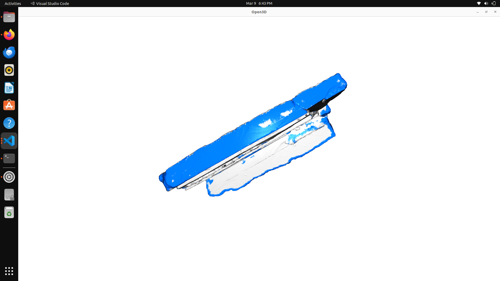
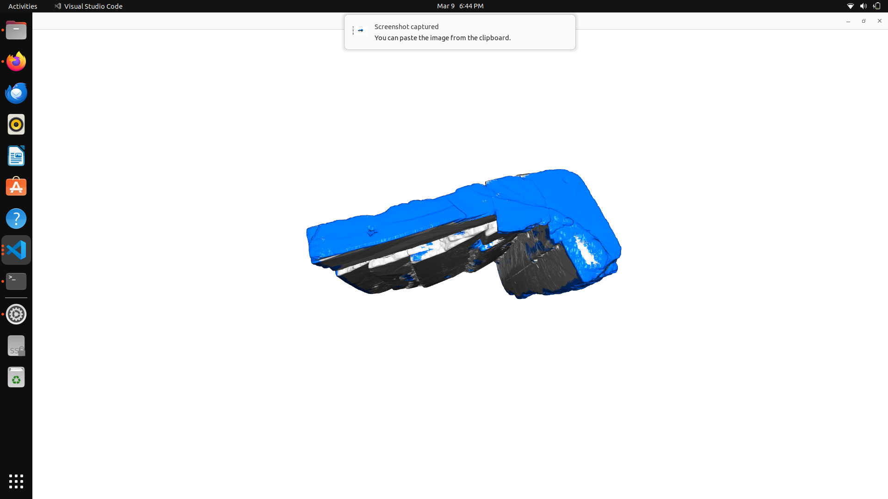
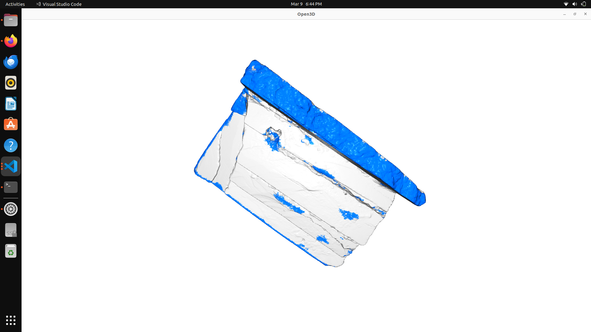
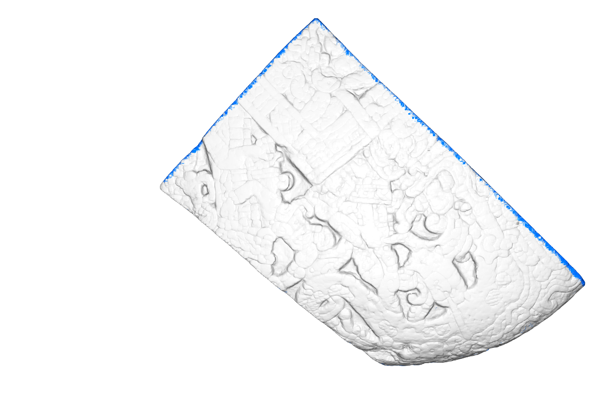
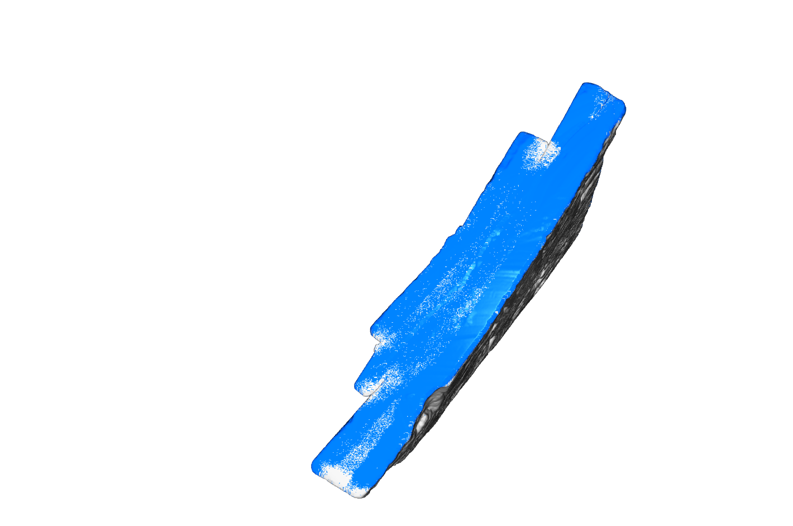

# Break Surface Detection on 3D Archaeological Stone Fragments

Automatic detection of break surfaces on 3D point cloud scans of stone fragments using PointNet++.  
Part of the **Healing Stones** project — reconstructing fragmented cultural heritage artifacts with AI.

---

## What It Does

Given a 3D scan of a stone fragment (`.ply` file), the model classifies every point as either:
- 🔵 **Break surface** — where the stone fractured (shown in blue)
- ⬜ **Original surface** — the weathered exterior (shown in grey)

This is the first step toward automated fragment reassembly.

---

## Project Structure

```
.
├── predict.py          # Run break surface detection (start here)
├── train.py            # Train the model on new GT fragments
├── preprocess.py       # Point cloud preprocessing (dedup, voxel, normals)
├── config.py           # All paths and hyperparameters
├── fix_ply.py          # Fix corrupted PLY files
├── model/
│   ├── pointnet2.py    # PointNet++ architecture
│   └── dataset.py      # Dataset and data loading
├── data/
│   ├── without_gt/     # <-- DROP YOUR PLY FILES HERE for prediction
│   └── with_gt/        # GT-labelled fragments for training
├── checkpoints/
│   └── best_model.pt   # Pretrained model weights
├── docs/               # Result screenshots
└── results/            # Output PLY files saved here
```

---

## Quickstart

### 1. Install dependencies

```bash
pip install torch torchvision open3d numpy scikit-learn
```

### 2. Get pretrained model

The pretrained model is included in this repo at `checkpoints/best_model.pt`.

### 3. Run prediction

```bash
# Default — runs on all files in data/without_gt/
python3 predict.py

# Single file
python3 predict.py path/to/fragment.ply

# Folder of fragments
python3 predict.py path/to/folder/
```

Results are saved to `results/`:
- `<fragment>_raw.ply` — raw model output (threshold only)
- `<fragment>_postprocessed.ply` — after iterative fill + noise removal
- `<fragment>_predictions.npz` — probability arrays for further processing

---

## Pipeline

```
Input PLY file
      |
      v
Preprocessing
  - Deduplication
  - Voxel downsample (0.5mm)
  - Statistical outlier removal
  - Normal estimation
      |
      v
PointNet++ Inference
  - For each point: extract 4096-point local neighbourhood
  - Hierarchical feature learning: 4096 -> 1024 -> 256 -> 64 -> global
  - Output: break probability per point
      |
      v
Post-processing
  - Threshold (default 0.5)
  - Probability pull-in (borderline points near high-confidence break regions)
  - Iterative fill (3 passes: recovers interior break points)
  - Erosion (removes isolated false positives)
  - DBSCAN cluster removal (removes small noise clusters)
      |
      v
Coloured PLY output
  Blue  = break surface
  Grey  = original surface
```

---

## Model

**Architecture:** PointNet++ (Set Abstraction layers + Global Aggregation + MLP classifier)  
**Input:** XYZ coordinates + surface normals (6 channels) per local patch of 4096 points  
**Output:** Binary classification — break (1) or original (0) per point  
**Parameters:** 1,797,634

| Model | Val F1 | Precision | Recall | Rotation Invariant |
|-------|--------|-----------|--------|--------------------|
| Random Forest (with normals) | 0.744 | 0.616 | 0.940 | No |
| Random Forest (without normals) | 0.592 | 0.504 | 0.716 | Yes |
| **PointNet++ (ours)** | **0.972** | **0.954** | **0.987** | **Yes** |

PointNet++ achieves **F1 = 0.972** while being fully rotation-invariant — a **64% improvement** over the rotation-invariant RF baseline and **31% improvement** over RF with orientation-dependent features.

---

## Dataset

| Fragment | Points | Break Points | Break % | Role |
|----------|--------|--------------|---------|------|
| frag1_GT | 3,130,575 | 354,433 | 11.3% | Training |
| frag2_GT | 3,414,941 | 383,440 | 11.2% | Training |
| frag11_GT | 1,867,860 | 498,562 | 26.7% | Training |
| frag3 (unseen) | 2,749,100 | — | — | Prediction |

Training uses balanced sampling: 50,000 break + 50,000 original samples per fragment, all fragments equally weighted. Random 3D rotation augmentation applied during training.

---

## Results

### Fragment 2 — Trained Fragment

Fragment 2 was part of the training set. The model predicted **541,155 break points (15.8%)**.  
Blue = predicted break surface, Grey = predicted original surface.

**Top/side view** — break surface (blue) cleanly separated from original (grey):



**Back view** — large continuous break region correctly detected:



**Front view** — original carved surface correctly classified as grey, break ridge in blue:



---

### Fragment 3 — Unseen Fragment (Generalization Test)

Fragment 3 was **NOT** in the training set — this tests cross-fragment generalization.  
The model predicted **196,227 break points (7.1%)**.  
Blue = predicted break surface, Grey = predicted original surface.

**Front face** — carved original surface correctly identified as grey; break edges detected in blue:



**Side view** — clean detection of the flat fracture face:



**Break face close-up** — break surface contiguously detected across the slab edge:


**Edge-on view** — break edge correctly identified; some scatter on flat face addressed by post-processing:


**What works well:**
- Break surface boundaries and edges detected accurately on unseen fragments
- Original carved surface correctly classified with very few false positives
- Model generalizes across fragments scanned at different orientations (rotation invariance confirmed)

**Known limitation:**
- Large flat interior break surfaces are partially missed on unseen fragments — the center of a flat break surface looks locally identical to the center of a flat original surface. The iterative fill post-processing step mitigates this by propagating inward from correctly detected edges.

---

## Training on New Data

To train on your own GT-labelled fragments:

1. Export fragments from Blender with break surfaces painted **green** (RGB: 0, 255, 0)
2. Place PLY files in `data/with_gt/`
3. Run:

```bash
python3 train.py
python3 train.py --epochs 100 --batch_size 32
```

Ground truth labels are extracted automatically from green vertex colours.

---

## Optional Flags

```
python3 predict.py [path] [options]

  path            Path to .ply file or folder (default: data/without_gt/)
  --checkpoint    Model checkpoint path       (default: checkpoints/best_model.pt)
  --threshold     Break probability cutoff    (default: 0.5)
  --batch_size    Patches per GPU per step    (default: 64)
  --voxel         Voxel downsample size       (default: 0.5)
```

---

## Hardware

- Runs on CPU (slow) or any CUDA GPU
- Multi-GPU supported automatically via `nn.DataParallel` — no configuration needed
- Tested on 3× NVIDIA RTX A4000 (16GB each)
- ~30–60 min per fragment on a single GPU depending on point count

---

## Current Limitations & Future Work

### Training Data
The current model is trained on only **3 annotated fragments** (frag1, frag2, frag11). This is the primary limitation — with more annotated fragments the model will generalize significantly better. Annotating additional fragments in Blender (painting break surfaces green) and rerunning `train.py` is all that is needed. No code changes required.

Expected improvement trajectory:

| Fragments in Training | Expected Generalization |
|---|---|
| 3 (current) | Good on similar geometry, some gaps on flat interior break regions |
| 6–8 | Strong generalization across most fragment types |
| 11+ (full dataset) | Near-complete generalization |

### Known Issues
- **Flat interior break surfaces** — the center of a large flat break surface looks locally identical to a flat original surface. The model correctly detects edges but may miss the interior. The iterative fill post-processing partially compensates for this.
- **Prediction speed** — each fragment takes 30–60 min on a single GPU because patches are built point-by-point using KDTree lookups on CPU. This is a pure engineering bottleneck, not a model limitation.

### Planned Improvements

**Short term**
- Annotate and train on remaining fragments — biggest single improvement with no architectural changes needed
- Batch KDTree lookups to speed up prediction by 10–50x
- Threshold tuning per fragment based on validation set

**Model architecture**
- PointNet++ with feature propagation layers (segmentation head) instead of classification head — would allow the model to directly output per-point labels without the patch-extraction step, massively speeding up inference
- Add curvature and roughness as explicit input features alongside XYZ + normals — these are strong geometric signals for break surfaces
- Attention mechanisms in the Set Abstraction layers to better weight informative neighbours

**Post-processing**
- Morphological closing on the predicted break region to fill interior holes more aggressively
- Graph-based smoothing — enforce spatial coherence via a CRF or graph cut on the probability map
- Learned post-processing — train a small GNN to refine raw predictions using spatial context

**Pipeline extensions (beyond break detection)**
- Feature descriptor extraction on detected break surfaces for fragment matching
- Pairwise fragment similarity scoring to predict which fragments share a break
- ICP-based alignment of matched break surfaces accounting for surface erosion and gaps

---

## Author

**Tarun**  
B.Tech Computer Science, IIITDM Kancheepuram | BS Data Science & AI, IIT Madras  
HPRCSE Labs — AI/ML Research  
GitHub: [github.com/tarun-227](https://github.com/tarun-227)
